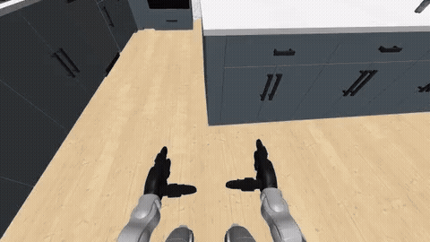

# ETHRC Humanoid — Whole-Body Control

Forked from NVIDIA's [GR00T-WholeBodyControl](https://github.com/NVlabs/GR00T-WholeBodyControl) for a Unitree G1 humanoid. The original simulation only shipped a handful of scenes with limited environment variation (e.g. `unitree_g1.LMPnPAppleToPlateDC`), so I integrated [RoboCasa](https://github.com/robocasa/robocasa) — a diverse household simulation benchmark — to get a much more modulable set of kitchen scenes (tables, chairs, fridges, countertops, ...) for the G1, which isn't natively supported by RoboCasa. Combined with Pico VR teleoperation, this is used to record teleoperated household-task demonstrations in simulation.

---

# Installation 

## For the first time : 
```shell
./docker/run_docker.sh --install --root
```

## Re enter the docker : 
```shell
./docker/run_docker.sh --root
```

## Installation of the robocasa objects 
```shell
python -m decoupled_wbc.dexmg.gr00trobocasa.robocasa.scripts.setup_macros

python -m decoupled_wbc.dexmg.gr00trobocasa.robocasa.scripts.download_kitchen_assets
```

# Run the script 

## Without teleop : 
```shell

python decoupled_wbc/scripts/deploy_g1.py     --interface sim     --camera_host localhost     --sim_in_single_process     --simulator robocasa     --image-publish     --enable-offscreen     --env_name PickPlaceBottleLoco    
```

## With teleop : 
On robot PC, double click app icon of XRoboToolkit-PC-Service or run service
```shell 
/opt/apps/roboticsservice/runService.sh
```

```shell
python decoupled_wbc/scripts/deploy_g1.py     --interface sim     --camera_host localhost     --sim_in_single_process     --simulator robocasa     --image-publish     --enable-offscreen     --env_name PickPlaceBottleLoco     --hand_control_device=pico     --body_control_device=pico
```

### Task prompt for the PickPlaceBottleLoco task

Turn right, move in front of the water bottle on the counter in front of the fridge, pick up the water bottle, then turn left, walk to the sink, and place the water bottle into the sink.


### Trim / augment a dataset

#### First time only — create the conda environment
```shell
bash trim_dashboard/setup_env.sh
```

This creates a `lerobot-trim` conda environment with Flask, PyArrow, NumPy, and huggingface_hub.

#### Fix output folder permissions (needed when dataset was created inside Docker)
```shell
sudo chown -R $USER outputs/
```

#### Run the dashboard
```shell
conda activate lerobot-trim
python trim_dashboard/app.py
```

Open http://localhost:5000 in your browser.

- **Select a dataset** from the dropdown — a `-trimmed` working copy is created automatically on first use.
- **Trim** episodes frame-by-frame, then click **Finalize (reindex)** when done.
- **Create Training Keys** generates a separate `-augmented` copy with the combined `action.locomanip` column (EEF + navigation commands) ready for training.
- **Upload** the resulting dataset to Hugging Face:
```shell
hf auth login
hf upload-large-folder ETHRC-humanoid/<dataset-name> outputs/<dataset-name>-augmented --repo-type dataset
```


## Example of teleoperated data

Example episode recorded with Pico teleoperation on the `PickPlaceBottleLoco` task in the RoboCasa kitchen:

<p align="center">
  
  <br>
  Full-quality video: <a href="videos/gr00t_episode_000000.mp4">gr00t_episode_000000.mp4</a>
</p>
